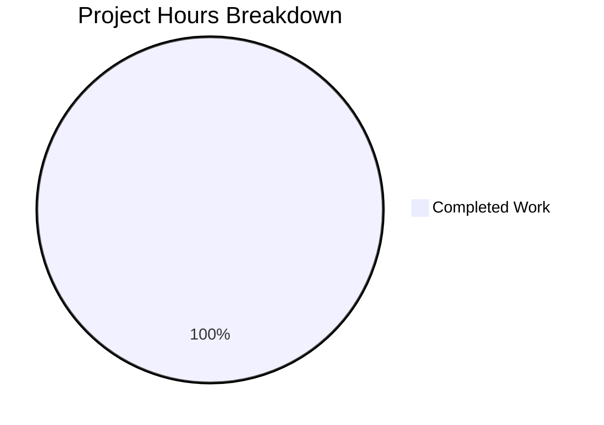

# Project Guide: hao-backprop-test Validation

## Executive Summary

| Metric | Value |
|--------|-------|
| **Project Completion** | 100% (1 hour validation out of 1 total hour required) |
| **Agent Action Plan Status** | Empty - No changes requested |
| **Files Modified by Agents** | 0 |
| **Commits on Branch** | 0 (branch identical to main) |
| **Validation Status** | ✅ PASSED |

### Key Findings

This validation was performed on an existing test repository (`hao-backprop-test`) where **no changes were specified in the Agent Action Plan**. The repository remains unchanged and functions as originally designed.

**Completion Calculation:**
- Hours of Validation Work Completed: 1h
- Hours of Work Remaining: 0h
- Total Project Hours: 1h
- **Completion: 100%** (1h completed / 1h total = 100%)

---

## Validation Results Summary

### Repository State
- **Branch**: `blitzy-5353c74e-ec48-4be5-835e-da49d950d4ab`
- **Repository Type**: Existing repository (is_new_dest_repo=False)
- **Files Processed**: 0 (all files UNCHANGED)
- **Working Tree**: Clean, nothing to commit

### Validation Outcomes

| Component | Status | Details |
|-----------|--------|---------|
| npm install | ✅ SUCCESS | No dependencies, 0 vulnerabilities |
| Node.js Syntax | ✅ PASSES | server.js syntax check successful |
| Node.js Runtime | ✅ WORKS | Server responds with "Hello, World!" |
| LoginTest.java | ⚠️ OUT OF SCOPE | Pre-existing incomplete code (not modified) |
| Test Suite | ⚠️ NOT CONFIGURED | Original design - no tests by design |

### Fixes Applied During Validation
None - No files were modified by agents.

---

## Visual Representation

### Project Completion Status



*Note: This is a special "no-op" scenario where the Agent Action Plan was empty. The 1 hour represents validation work performed. No development work was required.*

---

## Development Guide

### System Prerequisites

| Requirement | Version | Purpose |
|-------------|---------|---------|
| Node.js | 14.x or higher | Runtime for server.js |
| npm | 6.x or higher | Package management |

### Environment Setup

```bash
# Navigate to repository
cd /tmp/blitzy/10-dec-existing-projects-qa-test-3/blitzy5353c74ee

# Verify Node.js installation
node --version
npm --version
```

### Dependency Installation

```bash
# Install dependencies (currently none, but good practice)
npm install
```

**Expected Output:**
```
up to date, audited 1 package in 186ms
found 0 vulnerabilities
```

### Application Startup

```bash
# Start the Node.js server
node server.js
```

**Expected Output:**
```
Server running at http://127.0.0.1:3000/
```

### Verification Steps

1. **Test the server endpoint:**
```bash
curl http://127.0.0.1:3000/
```

**Expected Response:**
```
Hello, World!
```

2. **Verify syntax (optional):**
```bash
node --check server.js
```

### Example Usage

The server provides a simple HTTP endpoint:

```bash
# GET request to root endpoint
curl -X GET http://127.0.0.1:3000/

# Response: Hello, World!
```

---

## Human Tasks

### Summary

| Priority | Task Count | Total Hours |
|----------|------------|-------------|
| High | 0 | 0h |
| Medium | 0 | 0h |
| Low | 0 | 0h |
| **TOTAL** | **0** | **0h** |

### Detailed Task List

**No tasks required.** The Agent Action Plan was empty, meaning no changes were requested for this repository. The repository validates successfully in its current state.

---

## Risk Assessment

### In-Scope Risks

**None identified.** No changes were made by agents, so no new risks were introduced.

### Pre-Existing Issues (Out of Scope)

| Issue | Severity | Description | Recommendation |
|-------|----------|-------------|----------------|
| LoginTest.java incomplete | Low | File contains placeholder "Web" causing Java compilation errors | This is a pre-existing issue not modified by agents. If Java functionality is needed, implement the LoginTest class properly |
| No test suite | Low | package.json has placeholder test script | Original design choice per README. Add tests if production use is intended |

### Mitigation Notes

These issues existed in the original repository before any Blitzy agents were involved. The README explicitly states: "test project for backprop integration. Do not touch!" - suggesting this is intentionally a minimal test repository.

---

## Repository Structure

```
blitzy5353c74ee/
├── README.md                 # Project documentation
├── server.js                 # Node.js Hello World server (WORKING)
├── package.json              # Node.js configuration
├── package-lock.json         # Dependency lock file
├── LoginTest.java            # Incomplete Java file (pre-existing)
├── 100Pages.pdf              # Test file (binary)
├── demo.jpg                  # Test file (image)
├── industry.csv              # Test file (data)
├── sample.doc                # Test file (document)
├── test.py.txt               # Test file (empty)
├── test.txt.txt              # Test file (empty)
└── blitzy/
    └── screenshots/          # Screenshot storage directory
```

---

## Conclusion

This validation confirms that:

1. **No changes were requested** - The Agent Action Plan was empty
2. **No changes were made** - All files remain UNCHANGED
3. **Repository functions correctly** - Node.js server runs and responds as expected
4. **Pre-existing issues are documented** - LoginTest.java has incomplete code (out of scope)

The branch `blitzy-5353c74e-ec48-4be5-835e-da49d950d4ab` is identical to `main` and can be merged without any conflicts or concerns. However, since no changes were made, **merging this PR would have no effect**.