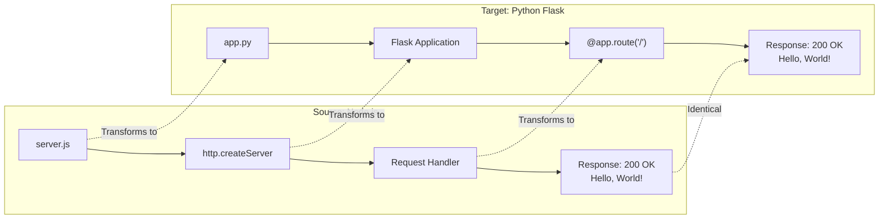
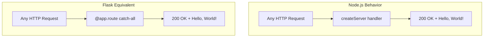

# Agent Action Plan

# 0. Agent Action Plan
## 0.1 Intent Clarification updates 123 asdasdas asdasdads

This section establishes precise technical objectives for the Node.js to Python Flask migration, ensuring crystal-clear interpretation of user requirements.

### 0.1.1 Core Refactoring Objective

Based on the prompt, the Blitzy platform understands that the refactoring objective is to **completely rewrite the existing Node.js HTTP server into a Python 3 Flask application** while maintaining exact feature parity and behavioral consistency with the original implementation.

| Attribute | Value |
| --- | --- |
| Refactoring Type | **Tech Stack Migration** (Node.js → Python Flask) |
| Target Repository | Same repository (in-place migration/rewrite) |
| Behavior Preservation | 100% functional equivalence required |
| API Contract | Maintain identical HTTP endpoint behavior |

**Specific Refactoring Goals:**

- **Language Migration**: Transition from JavaScript (Node.js runtime) to Python 3
- **Framework Migration**: Replace Node.js core `http` module with Flask micro-framework
- **Feature Preservation**: Replicate all existing server functionality exactly
- **Response Parity**: Ensure identical HTTP responses (status code, headers, body)
- **Endpoint Behavior**: Maintain the same request handling logic

**Implicit Requirements Identified:**

- The Flask application must bind to the same address pattern (127.0.0.1:3000) for equivalent local development experience
- HTTP response characteristics must match: `200 OK`, `Content-Type: text/plain`, body: `Hello, World!\n`
- Console output should provide equivalent server startup messaging
- The application must be runnable as a standalone Python script

### 0.1.2 Special Instructions and Constraints

**User Directives:**

- "Rewrite this Node.js server into a Python 3 Flask application"
- "Keeping every feature and functionality exactly as in the original Node.js project"
- "Ensure the rewritten version fully matches the behavior and logic of the current implementation"

**Migration Requirements:**

| Requirement | Interpretation |
| --- | --- |
| Feature Completeness | Every endpoint and response must be functionally identical |
| Behavioral Matching | HTTP request handling must produce identical outputs |
| Logic Preservation | Server initialization and request processing logic must be equivalent |
| No Feature Regression | No functionality may be lost or degraded during migration |

**Technical Constraints:**

- Python 3 is explicitly required (Python 3.9+ recommended for Flask 3.1.x compatibility)
- Flask framework is mandated for the HTTP server implementation
- Must maintain the simple, single-file architecture pattern of the original
- No additional features should be added beyond what exists in the source

### 0.1.3 Technical Interpretation

This refactoring translates to the following technical transformation strategy:

**Current Architecture → Target Architecture Mapping:**



**Transformation Rules:**

| Source Pattern | Target Pattern |
| --- | --- |
| `const http = require('http')` | `from flask import Flask` |
| `http.createServer((req, res) => {...})` | `@app.route('/')` decorator with route function |
| `res.statusCode = 200` | Flask default return (200 implied) |
| `res.setHeader('Content-Type', 'text/plain')` | `return response, 200, {'Content-Type': 'text/plain'}` |
| `res.end('Hello, World!\n')` | `return 'Hello, World!\n'` |
| `server.listen(port, hostname, callback)` | `app.run(host=hostname, port=port)` |
| `console.log(...)` | `print(...)` |

**Key Behavioral Equivalence Points:**

- Both implementations must return HTTP 200 status
- Both must set Content-Type header to `text/plain`
- Both must return exact string `Hello, World!\n` (with newline)
- Both must bind to `127.0.0.1:3000` by default
- Both must print startup confirmation message to console

## 0.2 Source Analysis

This section provides a comprehensive discovery and mapping of all source files requiring transformation for the Node.js to Python Flask migration.

### 0.2.1 Comprehensive Source File Discovery

**Repository Structure Analysis:**

The source repository is a minimal Node.js project with the following structure:

```plaintext
Current Repository Structure:
/
├── server.js              (PRIMARY - 15 lines, Node.js HTTP server)
├── package.json           (Project metadata, npm manifest)
├── package-lock.json      (Dependency lockfile - no external deps)
├── README.md              (Project documentation)
├── industry.csv           (Data file - 44 rows of industry categories)
├── LoginTest.java         (Unrelated Java scaffold - non-functional)
├── test.py.txt            (Empty placeholder file)
└── test.txt.txt           (Empty placeholder file)
```

**Search Patterns Applied:**

| Pattern | Files Found | Action Required |
| --- | --- | --- |
| `*.js` (JavaScript source) | `server.js` | Full rewrite to Python |
| `package*.json` (npm manifests) | `package.json`, `package-lock.json` | Replace with Python equivalents |
| `*.md` (Documentation) | `README.md` | Update for new technology |
| `*.csv` (Data files) | `industry.csv` | Preserve as-is (data asset) |
| `*.java` (Java source) | `LoginTest.java` | Out of scope (non-functional scaffold) |
| `*.txt` (Text placeholders) | `test.py.txt`, `test.txt.txt` | Out of scope (empty placeholders) |

### 0.2.2 Source Files Requiring Transformation

**Primary Source File:** `server.js`

| Attribute | Value |
| --- | --- |
| Path | `/server.js` |
| Lines of Code | 15 |
| Purpose | Minimal HTTP server returning "Hello, World!" |
| Dependencies | Node.js core `http` module only |
| Entry Point | Standalone script (`node server.js`) |

**Source Code Characteristics:**

```javascript
// server.js - Key components requiring transformation:
const http = require('http');      // Core module import
const hostname = '127.0.0.1';      // Server binding address
const port = 3000;                 // Server port
http.createServer((req, res) => {  // Request handler
  res.statusCode = 200;            // Response status
  res.setHeader('Content-Type', 'text/plain'); // Response header
  res.end('Hello, World!\n');      // Response body
});
server.listen(port, hostname, callback);  // Server startup
```

**Project Metadata:** `package.json`

| Field | Value |
| --- | --- |
| name | `hello_world` |
| version | `1.0.0` |
| description | `Hello world in Node.js` |
| main | `index.js` (unused) |
| author | `hxu` |
| license | `MIT` |
| dependencies | None |
| devDependencies | None |

### 0.2.3 Complete Source File Inventory

| File | Type | Lines | Transform Action | Priority |
| --- | --- | --- | --- | --- |
| `server.js` | JavaScript | 15 | **CREATE** Python equivalent (`app.py`) | Critical |
| `package.json` | JSON | 11 | **CREATE** Python equivalent (`requirements.txt`) | High |
| `package-lock.json` | JSON | 13 | **DELETE** (npm-specific, no Python equivalent needed) | Medium |
| `README.md` | Markdown | 2 | **UPDATE** documentation for Python/Flask | Medium |
| `industry.csv` | CSV | 45 | **PRESERVE** as-is (data asset) | Low |
| `LoginTest.java` | Java | N/A | **OUT OF SCOPE** (non-functional test scaffold) | N/A |
| `test.py.txt` | Text | 0 | **OUT OF SCOPE** (empty placeholder) | N/A |
| `test.txt.txt` | Text | 0 | **OUT OF SCOPE** (empty placeholder) | N/A |

### 0.2.4 Dependency Analysis

**Current Node.js Dependencies:**

| Dependency Type | Package | Version | Usage |
| --- | --- | --- | --- |
| Core Module | `http` | Built-in | HTTP server creation |
| External | None | N/A | Zero external dependencies |

**Analysis Summary:**

The source project has **zero external npm dependencies**. It relies solely on the Node.js built-in `http` module. This significantly simplifies the migration as there are no third-party library equivalents to identify or validate.

**Package Lockfile Status:**

The `package-lock.json` file exists but contains only root package metadata with no dependency entries (`packages` object contains only the root entry). This confirms the zero-dependency architecture.

### 0.2.5 Code Complexity Assessment

| Metric | Value | Impact on Migration |
| --- | --- | --- |
| Total Lines of Code | 15 | Low complexity |
| Number of Routes | 1 (catch-all) | Simple routing |
| HTTP Methods | All (catch-all handler) | Flask can replicate easily |
| External Dependencies | 0 | No dependency mapping needed |
| Configuration Files | 1 (package.json) | Simple metadata transfer |
| Data Files | 1 (industry.csv) | No transformation needed |

The source codebase presents minimal complexity for migration, with a straightforward single-file server implementation requiring direct translation to Flask patterns.

## 0.3 Target Design

This section defines the target architecture for the Python Flask application, including recommended structure, design patterns, and configuration files.

### 0.3.1 Refactored Structure Planning

**Target Repository Structure:**

```plaintext
Target:
/
├── app.py                 (PRIMARY - Flask application server)
├── requirements.txt       (Python dependency manifest)
├── README.md              (Updated documentation for Flask)
├── industry.csv           (Preserved data file)
├── LoginTest.java         (Unchanged - out of scope)
├── test.py.txt            (Unchanged - out of scope)
└── test.txt.txt           (Unchanged - out of scope)
```

**Standalone Operation Requirements:**

Since this is a rewrite within the same repository, the target structure includes all necessary files for standalone Flask operation:

| File | Purpose | Status |
| --- | --- | --- |
| `app.py` | Main Flask application entry point | **CREATE** |
| `requirements.txt` | Python package dependencies | **CREATE** |
| `README.md` | Project documentation | **UPDATE** |

### 0.3.2 Target File Specifications

[**app.py**](http://app.py) **- Flask Application Server**

| Attribute | Value |
| --- | --- |
| Framework | Flask 3.1.x |
| Python Version | 3.9+ |
| Host Binding | `127.0.0.1` |
| Port | `3000` |
| Routes | Single catch-all route (`/`) |
| Response Type | `text/plain` |

**Expected Flask Implementation Pattern:**

```python
from flask import Flask
app = Flask(__name__)

@app.route('/', defaults={'path': ''})
@app.route('/<path:path>')
def hello(path):
    return 'Hello, World!\n', 200, {'Content-Type': 'text/plain'}

if __name__ == '__main__':
    print('Server running at http://127.0.0.1:3000/')
    app.run(host='127.0.0.1', port=3000)
```

**requirements.txt - Dependency Manifest**

| Package | Version | Purpose |
| --- | --- | --- |
| Flask | &gt;=3.1.0 | Web application framework |

### 0.3.3 Web Search Research Conducted

Research was conducted on best practices for Node.js to Flask migration:

| Research Topic | Key Findings |
| --- | --- |
| Node.js to Flask migration | Migrating routes requires adjusting syntax while keeping logic similar |
| Flask conventions | Flask uses decorator-based routing (`@app.route`) vs Node.js callback patterns |
| Python virtual environments | Standard practice to use `venv` for isolated dependency management |
| Flask version requirements | Flask 3.1.x dropped support for Python 3.8; requires Python 3.9+ |
| Minimum dependencies | Flask depends on Werkzeug &gt;= 3.1, ItsDangerous &gt;= 2.2, Blinker &gt;= 1.9 |

### 0.3.4 Design Pattern Applications

**Pattern Selection:**

| Pattern | Application | Rationale |
| --- | --- | --- |
| Single-file Application | Main `app.py` contains all logic | Mirrors source simplicity |
| Application Factory (optional) | Not applied | Overkill for minimal server |
| Blueprint Pattern | Not applied | Single route, no modularization needed |
| Direct Route Handlers | `@app.route` decorators | Flask idiomatic approach |

**Behavioral Equivalence Design:**

The Node.js server uses a catch-all request handler that responds to ALL requests on ALL paths with the same "Hello, World!" response. The Flask equivalent must replicate this behavior:



### 0.3.5 Configuration Design

**Environment Configuration:**

| Configuration | Node.js Source | Flask Target |
| --- | --- | --- |
| Host | `const hostname = '127.0.0.1'` | `host='127.0.0.1'` in `app.run()` |
| Port | `const port = 3000` | `port=3000` in `app.run()` |
| Debug Mode | Not specified | `debug=False` (production default) |

**Startup Message:**

| Source | Target |
| --- | --- |
| `console.log(\`Server running at <http://$>{hostname}:${port}/\`)\` | `print('Server running at http://127.0.0.1:3000/')` |

### 0.3.6 API Contract Preservation

**HTTP Response Specification:**

| Attribute | Node.js Value | Flask Target Value |
| --- | --- | --- |
| Status Code | `200` | `200` |
| Content-Type | `text/plain` | `text/plain` |
| Response Body | `Hello, World!\n` | `Hello, World!\n` |
| Body Encoding | UTF-8 | UTF-8 |

**Critical Behavioral Note:**

The original Node.js server responds to ALL HTTP methods (GET, POST, PUT, DELETE, etc.) on ALL paths with the same response. The Flask implementation must replicate this catch-all behavior to ensure exact functional equivalence.

## 0.4 Transformation Mapping

This section provides the comprehensive file-by-file transformation plan mapping every source file to its target equivalent with detailed change specifications.

### 0.4.1 File-by-File Transformation Plan

**Complete Transformation Table:**

| Target File | Transformation | Source File | Key Changes |
| --- | --- | --- | --- |
| `app.py` | CREATE | `server.js` | Rewrite Node.js HTTP server as Flask application; convert `http.createServer` to Flask routes; translate JavaScript to Python 3 |
| `requirements.txt` | CREATE | `package.json` | Create Python dependency manifest with Flask&gt;=3.1.0; extract metadata concepts from npm format |
| `README.md` | UPDATE | `README.md` | Update project description from Node.js to Python Flask; document new run instructions |
| `industry.csv` | PRESERVE | `industry.csv` | No changes required; retain data file as-is |

**Transformation Mode Definitions:**

| Mode | Description |
| --- | --- |
| CREATE | Create a new file based on patterns from the source file |
| UPDATE | Modify existing file with new content |
| PRESERVE | Keep file unchanged |

### 0.4.2 Detailed File Transformations

[**app.py**](http://app.py) **(CREATE from server.js)**

| Source Element | Target Element | Transformation |
| --- | --- | --- |
| `const http = require('http')` | `from flask import Flask` | Replace Node.js core module with Flask import |
| `const hostname = '127.0.0.1'` | `host='127.0.0.1'` (in app.run) | Convert to Flask run parameter |
| `const port = 3000` | `port=3000` (in app.run) | Convert to Flask run parameter |
| `http.createServer((req, res) => {...})` | `@app.route('/')` decorator | Convert callback to decorator pattern |
| `res.statusCode = 200` | Return tuple with 200 status | Flask implicit/explicit return status |
| `res.setHeader('Content-Type', 'text/plain')` | Response headers dict | Flask headers in return tuple |
| `res.end('Hello, World!\n')` | `return 'Hello, World!\n'` | Direct string return |
| `server.listen(port, hostname, callback)` | `app.run(host, port)` | Flask application startup |
| `console.log(...)` | `print(...)` | JavaScript to Python output |

**requirements.txt (CREATE from package.json)**

| Source Field | Target Mapping | Notes |
| --- | --- | --- |
| `name: "hello_world"` | N/A | Not included in requirements.txt (optional [setup.py](http://setup.py)) |
| `version: "1.0.0"` | N/A | Not included in requirements.txt |
| `dependencies: {}` | `Flask>=3.1.0` | Replace npm deps with Python deps |
| `license: "MIT"` | N/A | Not included in requirements.txt |

[**README.md**](http://README.md) **(UPDATE)**

| Section | Current Content | Target Content |
| --- | --- | --- |
| Title | `# hao-backprop-test` | `# hao-backprop-test` (preserve) |
| Description | `test project for backprop integration. Do not touch!` | Update to reflect Python Flask implementation |
| Run Instructions | N/A | Add `python app.py` or `flask run` instructions |

### 0.4.3 Cross-File Dependencies

**Import Statement Updates:**

This migration does not require import statement updates across multiple files since the project consists of a single-file server with no internal module dependencies.

| Dependency Type | Source Pattern | Target Pattern |
| --- | --- | --- |
| Runtime Import | `require('http')` | `from flask import Flask` |
| Internal Modules | None | None |
| Configuration | Inline constants | Inline parameters |

**Configuration Updates for New Structure:**

| Configuration Aspect | Source Location | Target Location |
| --- | --- | --- |
| Project metadata | `package.json` | `requirements.txt` (deps only) |
| Entry point | `server.js` (via `node server.js`) | `app.py` (via `python app.py`) |
| Dependencies | `package-lock.json` | Virtual environment + `requirements.txt` |

### 0.4.4 Code Translation Rules

**JavaScript to Python Syntax Mapping:**

| JavaScript | Python |
| --- | --- |
| `const` variable declaration | Direct assignment |
| Arrow function `(req, res) => {}` | `def function_name():` |
| Template literal `` `text ${var}` `` | f-string `f'text {var}'` |
| `console.log()` | `print()` |
| Callback pattern | Decorator pattern |
| `module.exports` | Not needed (script execution) |

**HTTP Framework Mapping:**

| Node.js http Module | Flask Equivalent |
| --- | --- |
| `http.createServer()` | `Flask(__name__)` |
| `server.listen()` | `app.run()` |
| `res.statusCode` | Return tuple second element |
| `res.setHeader()` | Return tuple third element (dict) |
| `res.end()` | Return statement |

### 0.4.5 Files Excluded from Transformation

| File | Reason for Exclusion |
| --- | --- |
| `LoginTest.java` | Non-functional Java scaffold unrelated to HTTP server |
| `test.py.txt` | Empty placeholder file |
| `test.txt.txt` | Empty placeholder file |
| `package-lock.json` | npm-specific lockfile with no Python equivalent |

### 0.4.6 One-Phase Execution Plan

**Critical:** The entire refactoring transformation will be executed by Blitzy in **ONE phase**. All file transformations are included in a single execution cycle.

**Execution Order:**

| Step | Action | File |
| --- | --- | --- |
| 1 | CREATE | `app.py` (from `server.js`) |
| 2 | CREATE | `requirements.txt` (from `package.json`) |
| 3 | UPDATE | `README.md` |
| 4 | PRESERVE | `industry.csv` |

**No Multi-Phase Splitting:**

This refactoring does NOT require multiple phases. All transformations are:

- Independent (no circular dependencies)
- Atomic (each file can be created/updated independently)
- Complete (full functionality achieved in single phase)

## 0.5 Dependency Inventory

This section catalogs all private and public packages relevant to the Node.js to Python Flask migration, including source dependencies to be replaced and target dependencies to be introduced.

### 0.5.1 Source Dependency Analysis (Node.js)

**Current npm Dependencies:**

| Registry | Package Name | Version | Purpose | Status |
| --- | --- | --- | --- | --- |
| npm (built-in) | `http` | Node.js core | HTTP server creation | **TO BE REPLACED** |
| npm | (none) | N/A | No external dependencies | N/A |

**package.json Dependency Verification:**

```json
{
  "dependencies": {},
  "devDependencies": {}
}
```

The source project has **zero external npm dependencies**. The only module used is the Node.js built-in `http` module, which does not require installation.

### 0.5.2 Target Dependency Specification (Python Flask)

**Required Python Packages:**

| Registry | Package Name | Version | Purpose |
| --- | --- | --- | --- |
| PyPI | Flask | &gt;=3.1.0 | WSGI web application framework |

**Transitive Dependencies (automatically installed with Flask):**

| Package | Version | Purpose |
| --- | --- | --- |
| Werkzeug | &gt;=3.1 | WSGI utilities and request/response objects |
| Jinja2 | &gt;=3.1.2 | Template engine (not used but required) |
| itsdangerous | &gt;=2.2 | Data signing for security |
| click | &gt;=8.1.3 | Command-line interface support |
| blinker | &gt;=1.9 | Signal support for Flask |
| MarkupSafe | &gt;=2.0 | HTML escaping (Jinja2 dependency) |

### 0.5.3 requirements.txt Specification

**Target File Content:**

```plaintext
Flask>=3.1.0
```

**Version Justification:**

| Decision | Rationale |
| --- | --- |
| Flask&gt;=3.1.0 | Latest stable release with Python 3.9+ support |
| No pinned versions | Simple project with minimal dependency complexity |
| No dev dependencies | No testing framework specified in source |

### 0.5.4 Runtime Environment Requirements

**Python Version:**

| Requirement | Specification | Source |
| --- | --- | --- |
| Python Version | 3.9+ | Flask 3.1.x dropped Python 3.8 support |
| Recommended | Python 3.11 or 3.12 | Latest stable releases |

**Virtual Environment Setup:**

```bash
# Create virtual environment
python3 -m venv venv

#### Activate virtual environment (Unix/macOS)
source venv/bin/activate

#### Activate virtual environment (Windows)
venv\Scripts\activate

#### Install dependencies
pip install -r requirements.txt
```

### 0.5.5 Dependency Mapping: Source to Target

**Framework Equivalence:**

| Node.js Component | Python Equivalent | Notes |
| --- | --- | --- |
| `http` (core module) | `Flask` | Full framework vs core module |
| `npm` | `pip` | Package manager |
| `package.json` | `requirements.txt` | Dependency manifest |
| `package-lock.json` | `requirements.txt` (pinned) or `pip freeze` | Lock mechanism |
| `node_modules/` | `venv/lib/` | Installed packages location |

### 0.5.6 Import Refactoring

**Files Requiring Import Updates:**

Since this is a complete rewrite rather than incremental modification, import refactoring is handled through file creation:

| Target File | Import Statements |
| --- | --- |
| `app.py` | `from flask import Flask` |

**Import Transformation Rules:**

| Source Import | Target Import |
| --- | --- |
| `const http = require('http')` | `from flask import Flask` |

### 0.5.7 External Reference Updates

**Configuration File Changes:**

| File Type | Source File | Target Handling |
| --- | --- | --- |
| Package manifest | `package.json` | Replace with `requirements.txt` |
| Lock file | `package-lock.json` | Remove (use pip freeze if needed) |
| Documentation | `README.md` | Update run instructions |

**Build/Run Command Changes:**

| Operation | Node.js Command | Python Command |
| --- | --- | --- |
| Install dependencies | `npm install` | `pip install -r requirements.txt` |
| Run server | `node server.js` | `python app.py` |
| Alternative run | N/A | `flask run --host=127.0.0.1 --port=3000` |

### 0.5.8 Dependency Verification Checklist

| Check | Status | Notes |
| --- | --- | --- |
| Flask version exists on PyPI | ✓ Verified | Flask 3.1.2 is latest stable |
| Python version compatibility | ✓ Verified | Python 3.9+ required |
| No conflicting dependencies | ✓ Verified | Clean dependency tree |
| No private packages required | ✓ Verified | All public PyPI packages |
| No version placeholder used | ✓ Verified | Real version &gt;=3.1.0 specified |

## 0.6 Scope Boundaries

This section definitively establishes the boundaries of the Node.js to Python Flask migration, clearly delineating what is included and excluded from the transformation scope.

### 0.6.1 Exhaustively In Scope

**Source Transformations:**

| Pattern | Files Matched | Action |
| --- | --- | --- |
| `server.js` | 1 file | Full rewrite to Python Flask |
| `package.json` | 1 file | Transform to `requirements.txt` |
| `README.md` | 1 file | Update documentation |

**Target File Creations:**

| Target File | Description | Priority |
| --- | --- | --- |
| `app.py` | Flask application server | Critical |
| `requirements.txt` | Python dependencies | High |

**Configuration Updates:**

| Configuration Type | Files | Changes Required |
| --- | --- | --- |
| Project metadata | `package.json` → `requirements.txt` | Create Python equivalent |
| Documentation | `README.md` | Update run instructions and technology description |

**Documentation Updates:**

| File | Change Type | Description |
| --- | --- | --- |
| `README.md` | UPDATE | Add Python/Flask run instructions |

**Data File Preservation:**

| File | Action | Rationale |
| --- | --- | --- |
| `industry.csv` | PRESERVE | Data asset unrelated to runtime technology |

### 0.6.2 Scope Inclusion Summary Table

| Category | In Scope Items |
| --- | --- |
| **Primary Server Code** | `server.js` → `app.py` |
| **Dependency Management** | `package.json` → `requirements.txt` |
| **Documentation** | `README.md` updates |
| **Data Assets** | `industry.csv` (preserve) |
| **HTTP Functionality** | All endpoint behavior |
| **Response Handling** | Status codes, headers, body |
| **Server Configuration** | Host, port, startup message |

### 0.6.3 Explicitly Out of Scope

**Files Excluded from Transformation:**

| File | Reason for Exclusion |
| --- | --- |
| `LoginTest.java` | Non-functional Java scaffold file; contains syntax error; unrelated to HTTP server functionality |
| `test.py.txt` | Empty placeholder file (0 bytes); no functional content |
| `test.txt.txt` | Empty placeholder file (0 bytes); no functional content |
| `package-lock.json` | npm-specific lockfile; no direct Python equivalent needed; dependency locking handled via `requirements.txt` |

**Functionality Excluded:**

| Feature | Status | Rationale |
| --- | --- | --- |
| Database integration | OUT OF SCOPE | Not present in source |
| Authentication | OUT OF SCOPE | Not present in source |
| Additional routes | OUT OF SCOPE | Source only has catch-all handler |
| Template rendering | OUT OF SCOPE | Source returns plain text only |
| Static file serving | OUT OF SCOPE | Not present in source |
| Logging framework | OUT OF SCOPE | Source uses basic console.log |
| Testing framework | OUT OF SCOPE | Source has no tests |
| CI/CD configuration | OUT OF SCOPE | No CI/CD files in source |
| Containerization | OUT OF SCOPE | No Docker files in source |

**Technology Aspects Excluded:**

| Aspect | Reason |
| --- | --- |
| Java code maintenance | `LoginTest.java` is non-functional and unrelated |
| npm ecosystem tooling | Being replaced entirely with Python tooling |
| Node.js runtime configuration | Being replaced with Python runtime |

### 0.6.4 Boundary Definitions

**What This Migration DOES:**

- ✅ Rewrites the HTTP server from Node.js to Python Flask
- ✅ Maintains exact functional equivalence
- ✅ Preserves HTTP response characteristics (status, headers, body)
- ✅ Creates Python dependency management (`requirements.txt`)
- ✅ Updates documentation for new technology stack
- ✅ Preserves data files unchanged

**What This Migration DOES NOT:**

- ❌ Add new features beyond source functionality
- ❌ Modify non-server files (Java, empty placeholders)
- ❌ Create testing infrastructure
- ❌ Add deployment configurations
- ❌ Implement advanced Flask features (blueprints, middleware)
- ❌ Change server behavior or responses
- ❌ Add authentication or security features

### 0.6.5 File-Level Scope Matrix

| File | In Scope | Action | Notes |
| --- | --- | --- | --- |
| `server.js` | ✅ Yes | Source for `app.py` | Core transformation target |
| `package.json` | ✅ Yes | Source for `requirements.txt` | Metadata extraction |
| `README.md` | ✅ Yes | UPDATE | Documentation refresh |
| `industry.csv` | ✅ Yes | PRESERVE | Data asset retention |
| `package-lock.json` | ❌ No | IGNORE | npm-specific artifact |
| `LoginTest.java` | ❌ No | IGNORE | Unrelated Java code |
| `test.py.txt` | ❌ No | IGNORE | Empty placeholder |
| `test.txt.txt` | ❌ No | IGNORE | Empty placeholder |

### 0.6.6 Acceptance Criteria for Scope Compliance

| Criterion | Measurement |
| --- | --- |
| All in-scope files transformed | 3 files (server.js, package.json, [README.md](http://README.md)) |
| All target files created | 2 files ([app.py](http://app.py), requirements.txt) |
| Functional equivalence verified | HTTP response matches original |
| Out-of-scope files unchanged | 4 files remain unmodified |
| No feature additions | Flask app does exactly what Node.js app did |

## 0.7 Special Instructions for Refactoring

This section captures all user-specified requirements and critical instructions that must be followed during the Node.js to Python Flask migration.

### 0.7.1 User-Specified Requirements

**Explicit User Directives:**

| Directive | Interpretation | Implementation Approach |
| --- | --- | --- |
| "Rewrite this Node.js server into a Python 3 Flask application" | Complete technology migration from JavaScript/Node.js to Python/Flask | Create `app.py` using Flask framework patterns |
| "Keeping every feature and functionality exactly as in the original" | 100% feature parity required; no additions, no omissions | Replicate catch-all route, response format, server binding |
| "Ensure the rewritten version fully matches the behavior and logic" | Behavioral equivalence must be verifiable | Same HTTP status, headers, body; same host:port binding |

### 0.7.2 Behavioral Preservation Requirements

**HTTP Response Preservation:**

| Attribute | Original Node.js | Required Flask Equivalent |
| --- | --- | --- |
| Status Code | `200` | `200` |
| Content-Type Header | `text/plain` | `text/plain` |
| Response Body | `Hello, World!\n` | `Hello, World!\n` (exact match including newline) |
| Response Encoding | UTF-8 | UTF-8 |

**Server Behavior Preservation:**

| Behavior | Original | Required Equivalent |
| --- | --- | --- |
| Bind Address | `127.0.0.1` | `127.0.0.1` |
| Port | `3000` | `3000` |
| Startup Message | `Server running at http://127.0.0.1:3000/` | Equivalent message |
| Request Handling | All methods, all paths | All methods, all paths |

### 0.7.3 Critical Implementation Guidelines

**Must-Follow Rules:**

- **Maintain All Public API Contracts**: The HTTP endpoint must behave identically

  - Any HTTP request to any path must return `Hello, World!\n`
  - Status code must be 200
  - Content-Type must be `text/plain`

- **Preserve All Existing Functionality**: No functionality may be removed

  - Catch-all request handling must be preserved
  - Console startup message must be displayed

- **No Feature Additions**: The Flask app must not add capabilities not present in Node.js source

  - No additional routes
  - No authentication
  - No middleware beyond Flask defaults
  - No template rendering
  - No database connections

- **Maintain Backward Compatibility**: Running either version should produce identical HTTP responses

### 0.7.4 Validation Requirements

**Functional Equivalence Test:**

```bash
# Start Flask server
python app.py &

#### Test HTTP response (should match Node.js behavior exactly)
curl -i http://127.0.0.1:3000/

#### Expected response:
## HTTP/1.1 200 OK
#### Content-Type: text/plain
# ...
#### Hello, World!
```

**Verification Checklist:**

| Test | Expected Result | Pass Criteria |
| --- | --- | --- |
| GET / | `Hello, World!\n` | Exact string match |
| GET /any/path | `Hello, World!\n` | Catch-all works |
| POST / | `Hello, World!\n` | All HTTP methods handled |
| Status code | 200 | Numeric match |
| Content-Type | text/plain | Header match |
| Server port | 3000 | Port binding match |
| Server host | 127.0.0.1 | Host binding match |

### 0.7.5 Technical Constraints

**Python Version:**

| Constraint | Value | Rationale |
| --- | --- | --- |
| Minimum Python | 3.9 | Flask 3.1.x requirement |
| Recommended Python | 3.11+ | Latest stable with performance improvements |

**Flask Configuration:**

| Setting | Value | Rationale |
| --- | --- | --- |
| Debug Mode | False | Production-like behavior matching Node.js |
| Host | 127.0.0.1 | Match original binding |
| Port | 3000 | Match original port |

### 0.7.6 Code Quality Standards

**Naming Conventions:**

| Element | Convention | Example |
| --- | --- | --- |
| Main file | Lowercase with underscores | `app.py` |
| Functions | Lowercase with underscores | `def hello():` |
| Constants | Uppercase (if extracted) | `HOST = '127.0.0.1'` |

**Code Structure:**

```python
# Recommended app.py structure:
# 1. Imports
# 2. App initialization
# 3. Route definitions
# 4. Main execution block
```

### 0.7.7 Documentation Requirements

[**README.md**](http://README.md) **Updates Must Include:**

- Technology stack change acknowledgment
- New run instructions for Python/Flask
- Preserved project purpose statement
- Dependency installation instructions

### 0.7.8 Refactoring Success Criteria

| Criterion | Metric | Target |
| --- | --- | --- |
| Feature Parity | All source features implemented | 100% |
| Behavioral Match | HTTP responses identical | 100% |
| Test Verification | Manual curl test passes | Pass |
| Code Quality | Clean, idiomatic Python | Yes |
| Documentation | README updated | Complete |
| Dependencies | requirements.txt valid | pip install succeeds |

### 0.7.9 Post-Migration State

**Expected Repository After Migration:**

```plaintext
/
├── app.py                 ← NEW: Flask application
├── requirements.txt       ← NEW: Python dependencies
├── README.md              ← UPDATED: New run instructions
├── industry.csv           ← UNCHANGED: Data file
├── server.js              ← ORIGINAL: Source reference (may be retained or removed)
├── package.json           ← ORIGINAL: npm manifest (may be retained or removed)
├── package-lock.json      ← ORIGINAL: Lock file (may be retained or removed)
├── LoginTest.java         ← UNCHANGED: Out of scope
├── test.py.txt            ← UNCHANGED: Out of scope
└── test.txt.txt           ← UNCHANGED: Out of scope
```

**Note on Source File Retention:** The original Node.js files (`server.js`, `package.json`, `package-lock.json`) may be retained for reference or removed based on project requirements. The migration creates new Python files alongside or in place of originals.
